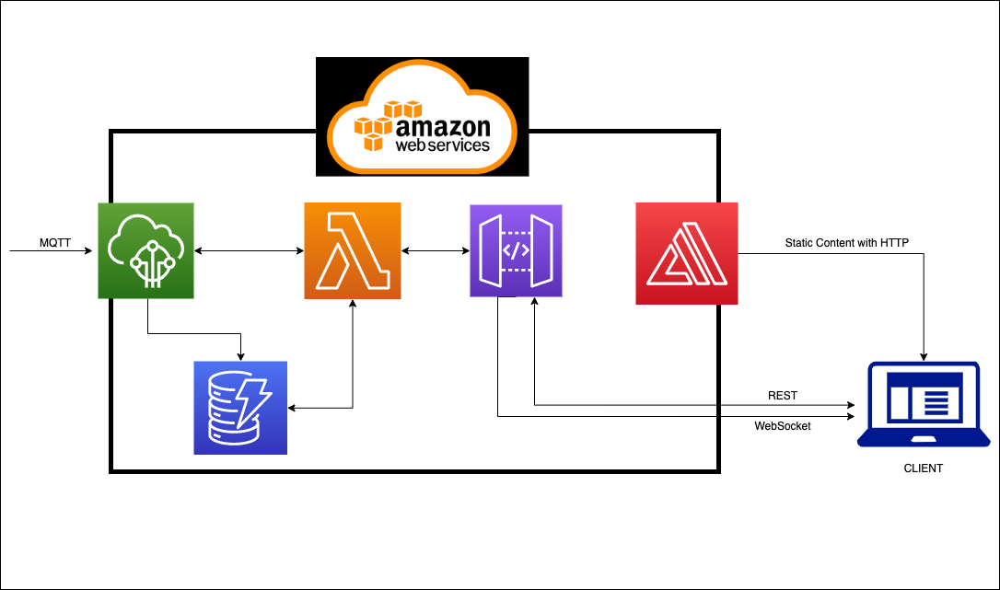
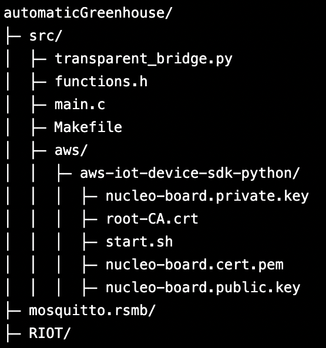

# automaticGreenhouse
This is the repository for the Internet of Thing 2021/2022 of the Master in Computer Science, La Sapienza Università di Roma

# General Description
The scope of the project is to create an automatic greenhouse that can act on the environment in which a plant is living to tailor the living space to the plant’s needs. By monitoring the environment, it’s possible to learn in real time the conditions in which the plant is living. In particular, the system measures those aspects that are fundamental to a plant, these being temperature, humidity and soil moisture. Knowing this information the system can promptly act in several ways: opening or closing the water, turning on and off a heating lamp or by keeping the light always on. 

## Sensors
So to take the measurements needed by the system the following two sensors were selected:
- ***DHT11 Humidity and Temperature***: <br> this sensor collects information on the temperature and on the air’s humidity and gives them to the system using an analog output. In particular, for the temperature it has a range of 0-50°C with an accuracy of +/- 2°C with a precision of 8 bits; and for the humidity we have a range of 20-90% RH (RH stands for Relative Humidity) with an accuracy of +/- 5% RH with a resolution of 8 bits. (the datasheet can be found here [DHT11 Datasheet](https://www.mouser.com/datasheet/2/758/DHT11-Technical-Data-Sheet-Translated-Version-1143054.pdf))

- ***Soil Humidity Sensor***: <br> this sensor collects information on the soil moisture using capacitive sensing (i.e its capacitance changes depending on how much moisture is present in the soil), it gives its output to the system as analog input. (the datasheet can found here [Soil Humidity Sensor Datasheet](https://cdn.shopify.com/s/files/1/1509/1638/files/Hygrometer_V1.2_Sensor_Modul_Datenblatt_AZ-Delivery_Vertriebs_GmbH.pdf?v=1608545956))

The sensing done by the sensor is periodic because the system needs to continuously evaluate the environment in which the plant is living, indeed an event-driven one would not make sense taking into account the analogical nature of what the system measures (i.e temperature …). In particular the interval at which the sensors take their measurements is 15 seconds so that the system can always be updated without being overloaded with values.<br>
Important that these sensors work independently even if the aspect they measure may depend on each other. For example air humidity may depend on the moisture in the soil but it also decreases with high temperature, for this reason the sensors must work in parallel to provide a correct and continuous evaluation of the environment.

## Actuators
Instead to act on the environment the following two actuators were selected:
- ***Servo Motor SG90***: <br> the servo motor open and closes the water, for this reason it’s activation/deactivation depends on the values detected by the soil moisture sensor so to keep the humidity of the soil between 20% and 60% (that is the adequate percentage for most types of plants – da controllare meglio questa cosa). More precisely the servo opens the water when the soil moisture gets lower than 20% and turn off the water when the moisture gets higher than 60% (the datasheet can be found here [Servo Motor Datasheet](http://www.ee.ic.ac.uk/pcheung/teaching/DE1_EE/stores/sg90_datasheet.pdf))

- ***Relay Module 5V/250VAC***: <br>the relay instead can be used in several ways depending on what the user goal is but in general is used to keep the temperature above a certain threshold by turning on and off a heating bulb. More precisely it is turned on if the temperature sensed by the dht11 sensor gets lower that (goal_temperature -10%) and is turned off if the value gets higher that (goal_temperature +10%) 	(NOTE: the +/- 10% are needed to avoid the relay to keep switching on and off due to very small changes in temperature) (the datasheet can be found here: [Relay Datasheet](https://components101.com/switches/5v-single-channel-relay-module-pinout-features-applications-working-datasheet))

The activation or deactivation of these actuators can be done manually by the user, but by default is done in an automatic way. 

### Data Processed on the by the Board
In general the amount of the data received from the sensors depends on how well the threads that handle the measurement are synchronized. If they are perfectly in sync, then the system would receive a total of 24 bits (8 bits for temperature, 8 bits for relative humidity and 8 bits for soil moisture). <br><br>
This data is then formatted in a message that is then sent to the broker. In particular to reduce the number of bytes sent by the device in the network the message has a payload size of 9 bytes when sending data about temperature and humidity, and size of 5 bytes when sending data about soil moisture. Obviously in addition to the payload the message has a header but in this case is small thanks to the use of mqtt-sn protocol.

# System Architecture
In the following section the architecture of the whole system will be described starting from an overall view of the network components, then analyzing all the cloud aspects, and in conclusion there will be a brief description of how the sensors and actuators are connected to the board.
<br>

<br>
The general architecture of the network can be described as a chain of blocks that exchange messages; this structure is shown in the image above. More in detail the block that compose the system are:
1. ***Nucleo-f401re Board***: <br> it generates and sends data to the broker that is in the next block of the chain using mqtt-sn, it publishes the messages on the topic “topic_out”. Moreover it is subscribed to the topic “topic_in” of the broker in the next block where it reads the instructions that are sent by the user.

2. ***MOSQUITTO***: <br> it is a MQTT-SN/MQTT message broker that is the closest block to the board indeed it interacts directly with it. In particular it stores the messages coming from the board in the topic “topic_out” and those going to the board in the topic “topic_in”. In theory any mqtt-sn/mqtt broker can have this role.

3. ***MQTT-SN/MQTT TRANSPARENT BRIDGE***:  <br> it is a python script that works as a bridge exchanging messages using MQTT between the broker in the previous block and the broker on the cloud in the next block of the chain. <br><br> It is subscribed to both the topic “topic_in” of the cloud broker (in the next block) and to the topic “topic_out” of the previous block broker. Indeed when a message is published on the “topic_in” of the cloud broker the transparent bridge reads it and publishes it on the previous block’s broker. Something similar happens when a message is published on the “topic_out” of the previous block, the bridge reads this new publication and publishes it into the cloud broker. <br> <br>Regarding the publishing of messages in the adjacent blocks we have a peculiarity, this block performs some edge computation. Indeed it has the role of changing the format of the messages to make them more suitable for the blocks it is bridging. In particular it does the following: 
   - messages coming from the previous block and going to the next one, it expands them turning the small payload more suitable for a mqtt-sn communication into a proper json object so that the cloud functions can easily work with it.
   - messages coming from the next block and going to the previous one, it compresses the json object into a smaller message so to reduce the payload size so that it can consume less bandwidth and be easily handled by the previous block in the chain.<br><br>
Moreover we have another peculiarity in how the messages are published on the cloud mqtt broker indeed in this case the messages are published on two different topics of the cloud broker: “topic_out_temp” and “topic_out_soil” in this way is easier to separate and elaborate the messages coming from different sensors.

4. ***Amazon Web Services***: <br> is the cloud part of the system. All the data it receives from the previous block on the topic “topic_out_temp” and “topic_out_soil” is processed, stored and then made available to the user using API REST. Moreover the user can send commands using API REST that publish the command on the topic “topic_in” of the previous block. (Obviously any cloud service provider correctly configured would work the same)

5. ***Web Application***: <br> last block of the chain. Allows the user to visualize the data collected by the system and interact with it. In particular using charts the user can see not only the measurements of the last hour but also see them almost in real time (we need to take into account the latency needed by the data to go from the board to the cloud services). Moreover some aggregated values are provided to the user like: the average, minimum and maximum values and the variation.

### Cloud Services



As already mentioned the cloud service provider used is Amazon Web Services. In particular the services used are:
- ***Iot Core***: <br> whose main role is to work as a mqtt broker where messages are published. Moreover, the rule engine of the service allowed us to directly act on the incoming messages, saving them on the DB and invoking functions when a new message arrives.
- ***DynamoDB***: <br> database where every data received from the board is stored. In particular it has 2 tables to store the information received and 1 used to keep track of the connections to the websocket service.
- ***Lambda***: <br> that allows us to write the functions for several purposes like: interact with the database, publish messages on a broker, handle the websocket (connection, disconnection and new information on the status). In particular it has 2 functions to read the data of the sensors (one per table), 1 function to publish messages on a broker, 3 functions to handle the websocket.
- ***API Gateway***: <br> to create and publish both the REST API and the WebSocket API
- ***AWS Amplify***: <br> to provide the web application’s static content to the user 


Now is possible to analyze the interaction with AWS from the point of view of the IoT Core broker receiving a message and from the one of a user accessing the web interface. <br>In the former we have that once the broker receives a message, it is received either on the “topic_out_temp” or on the “topic_out_soil” topic, in both cases two things happens: the information is stored in the corresponding table and the lambda function sends a messages with the data to all active connections on the websocket.<br><br> In the latter we have that the user asks to AWS Amplify using https for the static components of the web application, as soon as these are loaded the javascript in the web page does two things: invokes the REST API to obtain the data stored in the DynamoDB tables and connects to the websocket provided by an API of the API Gateway. <br>In this way the client has the data from the last hour and is kept updated thanks to the websocket. <br>Moreover from the web application the user has the ability by pressing some buttons to invoke an API that invokes a lambda function that publishes a message with a command to the board on the cloud broker.

### Connections to the Board

So to conclude this section a brief description on how the board, sensors and actuator are connected. The connections are rather simple as is possible to see from the above image:

<br>

- All the sensors and actuators are connected to Ground and 5V
- the relay module is connected to the digital pin Arduino pin D2(PA10 on the board)
- the servo motor is connected to the pin PA15 a PWM pin
- the dht11 sensor is connected to analog pin A1
- the capacitive soil moisture sensor is connected to analog pin A0 

(the position of the pins on the board can be see on the pinout image on the left)<br>
Obviously the board is connected to a laptop so that it can get power and use the ethos (ethernet-over-serial)  mechanism.

### Network Performances
Using a tool to analyze packets in the network (like wireshark) is possible to see how the network is affected by the message exchanged by the several components. Indeed the most problematic part of the connection is the link between the board and the mosquitto broker. In particular we have that the network traffic happening using UDP between these two components is:
- 33 bytes for sending data from the soil moisture sensor 
- 37 bytes for sending the data from the dht11 sensor. 

Assuming that the threads handling these measurements are synchronized we can say that a total of circa 16,8 kb per hour are generated and the needed bandwidth to run the system is of at least 4,7 bytes per second. <br><br>
Even if the bandwidth required to run the system is low for today's standards in some situations it may be needed to reduce even more the data transmitted. This is achievable if the transmission interval is increased, but in this the data collected on the cloud is less representative of the real state of the environment. To avoid this loss in accuracy the system could aggregate data on the node, for example at every timeout it does not send the last value sensed by the sensor but the average of the previous interval. So there is a clear tradeoff between the amount of data transmitted on the network and the system’s accuracy.<br><br>
The other link of interest is the one between the mosquitto broker and the cloud service provider, the main aspect here is that in the middle there is the transparent bridge that acts on the messages, but even if the message size increases and the protocol used to exchange messages is TCP (that uses in general more messages than UDP), the operation done by the transparent bridge are done on the edge and for this reason the presence of a more reliable bandwidth is almost guaranteed.


# WALKTHROUGH
The first steps to do are:
- download and setup RIOT OS as described in the official documentation ([RIOT OFFICIAL DOCUMENTATION](https://doc.riot-os.org/getting-started.html))
- download and setup the mosquitto broker as described in the official documentation ([DOCUMENTATION](https://github.com/eclipse/mosquitto.rsmb))
- download this repository

### Cluod Setup
- ***DynamoDB***: create 3 tables: 
   1. connection_table with Partition Key a string called“connection_id”
   2. soil_humidity_table with Partition Key a number called “id”
   3. temperature_table with Partition Key a number called “id”
- ***Lambda***: create 6 lambda functions choosing as language Node.js 14.x where to paste the code provided in this repository under the aws directory (see later for a brief description on how to add permission to a lambda function):
   1. connect: where to paste the code found in aws/connect.js and needs to have permission to access to DynamoDB
   2. disconnect: where to paste the code found in aws/disconnect.js and needs to have permission to access to DynamoDB
   3. publish2Broker where to paste the code found in aws/publish2Broker.js and and needs to have permission to access to IoT
   4. readTemeperature: where to paste the code found in aws/readTemperature.js and needs to have permission to access to DynamoDB
   5. readSoilHumidity: where to paste the code found in aws/readSoilHumidity.js and needs to have permission to access to DynamoDB
   6. readTemp4WebSocket: where to paste the code found in aws/readTemp4WebSocket.js and needs to have permission to access to DynamoDB, API Gateway and Execute API<br>
***NOTE: is fundamental to properly set up the permissions given to each function***

- ***IotCore***: click on “Connect a device” and follow the steps using as name of the thing "nucleo-board", at the end of the guided procedure it should have douwnloaded the following files: root-CA.crt, nucleo-board.cert.pem, nucleo-board.private.key. Move this files inside the aws folder in the directory downloaded from this repository so to have a directory tree like in the image on the right (aws-iot-device-sdk-python is a directory).
<br>
Now always from the IoT Core you need to go on Secure->Policies->nucleo-board-Policy then click on “Edit Active Policy” and append in the policy resource text area:
   - in the first one: resource_arn:topic/topic_out_soil,resource_arn:topic/topic_out_temp,resource_arn:topic/topic_in [elements MUST be separate with a comma WITHOUT spaces in between]
   - in the second one: resource_arn:topicfilter/topic_in
   - in the third one: resource_arn:client/nucleo
Once this is done click on “Save as new version” and set it as active one. <br>

The next step is to configure the rules of the rule engine so go on Act->Rules, here you need to create two rules:
   - in the first one set the “Rule query statement” as “SELECT temperature, humidity FROM 'topic_out_temp' “ and add the action to “insert a message into DynamoDB” giving as table name “temperature_table”, Partition key “id” and as Partition Key Value “$(timestamp())” (this will create a new element in the table with id the epoch time). Once this action has been added click again “Add Action” and select “Send message to Lambda Function” selecting as lambda function readTemp4WebSocket
   - in the second one set the “Rule query statement” as “SELECT soil_humidity FROM 'topic_out_soil'”, also here add the same action as the other rule changing only the table name in “soil_humidity_table”

- ***API Gateway***: there are 2 APIs needed:<br>
   - a WebSocket API called “sensors” with 4 routes each calling a lambda function: $connect that calls “connect”, $disconnect that calls “disconnect”, readTemp that calls “readTemp4WebSocket” and readSoil that also calls “readTEmp4WebSocket”.
   - a REST API also called sensors that has the structure in the image. In particular the POST on / should call the "publish2Broker" function, the GET on /soil_humidity should call "readSoilHumidity", the GET on /temperature_humidity should call "readTemperature". (take note of which are the endpoints of these resources because, because there will be needed on a later step)

- ***AWS Amplify***: first you need to edit the file index.html changing adding the link to your API in the following lines → da specificare alla fine. Once this is done create a new project and load the index.html file that you find inside the directory web app of this repository

With this the AWS setup is done.

### Board Setup
The next steps are:
- connect the sensors to the board like shown in the previous image.
- connect the board to you machine
<br>
Now go to the mosquitto.rsmb/rsmb/src folder and execute the following command:
```
./broker_mqtt config.conf
```
and leave the broker running. <br>
Open a new terminal on MAIN/automaticGreenhouse and open the transparent_bridge.py and put on line (metti le righe) the corresponding path to the files downloaded from aws, save and close. Then execute:
```
python3 transparent_bridge.py
```
as before leave the bridge running and open a new terminal in the same  folder and execute 
```
make BOARD=nucleo-f401re flash term
```

once the command is done i.e the serial monitor is shown, open a new terminal and execute the following command 
```
sudo ip a a 2000:2::1 dev tap0
```

then press the reset button on the board and after a few seconds if everything has been set up correctly the board should start to operate and on the web application the measurement should be showing.

